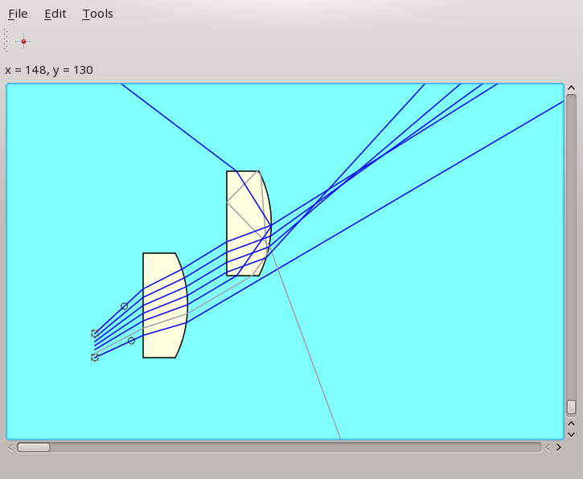

GeOptics
========

.. inclusion-marker-for-sphinx:start-intro

|geoptics| propagates light rays in **2D**, 
in the **Geometrical optics** approximation.

Modifying objects should be easy,
with a **live** update of the rays propagation.
The intent being to give a **fun** experience with optics.

That being said, **physical precision** is kept,
so |geoptics| might interest engineers or physicists
looking for a quick way to test ideas.

Features
--------

|geoptics| is currently in *alpha* stage, 
which means that not only the internals but also 
the API and file formats are going to change a lot,
probably losing backward compatibility.

Nevertheless, it seems quite usable, with the following features:

* **Regions** are defined by their enclosing surface and their 
  **refractive index**.
* **Non-sequential** propagation: intersections between the ray and the dioptres
  are determined at run-time.
* After each interface crossing, ray direction is determined by 
  Snell-Descartes laws.
* **Total internal reflection** is handled gracefully.
* Sources and regions can be **moved by mouse**.
  Rays propagation is **live** updated.
* Regions may **overlap**.
  The topmost regions determines the refractive index of the intersection.
* Scenes and individual sources and regions can be **saved** or **loaded**.
* **Graphical user interface** (currently Qt, but other toolkits could be added)
* **Command line** (IPython) creation, inspection and control of the scene.

Future
~~~~~~

* Region edition by mouse.
* Multiple undo/redo mechanism.
* Ideal thin lenses.
* Plugin mechanism for new types of regions or sources.
* Inspection and edition of sources or regions properties directly in the GUI.
* Live measurement of distances between nodes.
  (for instance between source and 
  first intersection of a ray with the optical axis)
* Wavelengths for rays, and materials for regions
  (currently, a single refractive index is used)
* Physical color (additive synthesis) for rays superposition, if so desired.
  This seems to work in pyoptics_.
* Demonstrations (rainbow, ...)
* (Serious) games:

  * puzzles: how to place sources or lenses to strike a target ?
  * shoot-them-up
  * build-a-base
  * ...
* List far from complete...

Installation
------------

Requirements
~~~~~~~~~~~~

* Python >= 3.4
* PyYAML_
* PyQt5_

The main gui toolkit is ``Qt``, but there is a good separation between GUI
and non GUI stuff.
In principle, this could allow for other toolkits as well. 
If there is enough interest, a limited ``tkinter`` gui could be revived,
for display purposes.

From repo
~~~~~~~~~
.. code-block:: shell

  $ git clone https://github.com/ederag/GeOptics.git
  $ cd GeOptics/

Usage
-----
  
Run the ``t_geo.py`` script

.. code-block:: shell

  $ python3 t_geo.py

or, to start with an empty scene,

.. code-block:: shell

  $ python3 -m geoptics

In the menu, select ``file>Open>screenshot.geoptics``;
the window should now resemble the above screenshot.

For an interactive command line control, there is an `interface with IPython`_.

Documentation
-------------

Documentation can be found online on `geoptics.readthedocs.io`_,
or built locally by going into the docs/ directory and issuing ``make html``.

Contributing
------------

.. later:
.. Contributions are very welcome. Tests can be run with `tox`_, please ensure
.. the coverage at least stays the same before you submit a pull request.

Contribution are welcome. Although beware that the code is in *alpha* stage,
with deep modifications ahead. 

For instance, currently the points passed as arguments are automatically copied.
This completely avoided side effects. But for handling regions modifications,
sharing a point between curves would make things easier. And more pythonic.

Help with these essential internals would be appreciated.
It should be advisable to discuss before any extensive work though.
There are some indications about the current design choices in the documentation.

.. FIXME: add a link once uploaded on readthedocs.

Otherwise, for the time being, please keep changes small,
preferably only small bug fixes.

Forks
~~~~~

Forks are welcome,
and upon progress could be mentioned here,
with a description of the main changes or goals.
This would reduce the "fork maze effect" that can be so puzzling.

History
-------

This project started years ago,
inspired by a long discontinued shareware program called **raytrace.exe**.
Meanwhile, a lot of other python projects emerged, including

- pyoptics_ (2D)
- rayopt_ (3D)
- OpenRayTrace_ (3D)
- pyOpTools_ (3D)
- ...

The list is far from complete. Please file an issue to ask for additions.

Had these projects been known earlier, this one would never have started.
And it snowballed, too big to stop... Let it be useful, 
or perhaps swallowed into another free software project. This would be nice.

License
-------

|geoptics| is free software, 
distributed under the terms of the "`GPL3 or later`_" license.

.. _GPL3 or later: https://www.gnu.org/licenses/gpl.html
.. _geoptics.readthedocs.io: https://geoptics.readthedocs.io/
.. _interface with IPython: https://geoptics.readthedocs.io/en/latest/geoptics.guis.qt.html#interface-with-ipython
.. _OpenRayTrace : https://github.com/BenFrantzDale/OpenRayTrace
.. _pyoptics: https://github.com/campagnola/pyoptics
.. _pyOpTools: https://github.com/cihologramas/pyoptools
.. _PyQt5: https://pypi.python.org/pypi/PyQt5
.. _PyYAML: https://pypi.python.org/pypi/PyYAML/
.. _rayopt: https://pypi.python.org/pypi/rayopt/
.. _tox: https://tox.readthedocs.io/

.. inclusion-marker-for-sphinx:end-intro

.. keep this after the end marker, to avoid double definition
.. can not use :program: role here, because this file should be readable
.. without sphinx
.. |geoptics| replace:: **GeOptics**
